CMPE277Assgn4-AndroidApp
========================

This is CMPE 277 Assignment 4 to learn following things:  

1. Usage of Intent to pass data from one activity to another 
2. How to execute task in Async like calling API's 
3. How to save data in Android Devices using SQL Lite &amp; Shared Preferences 
4. How to display data in List View from  DB, Array, Shared Preferences using Adapters. 

ScreenShots: 
==============

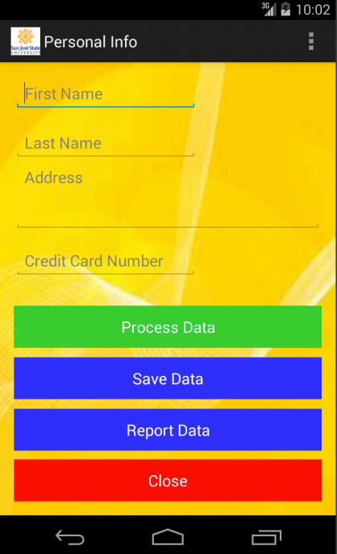   

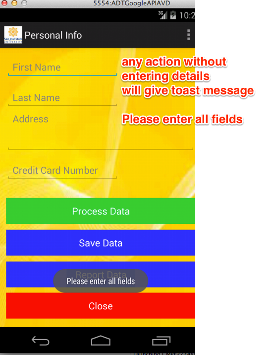

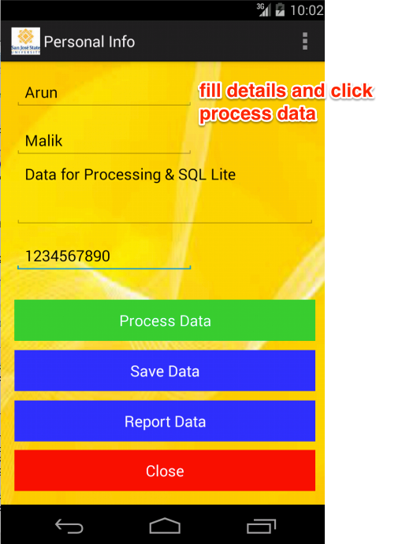

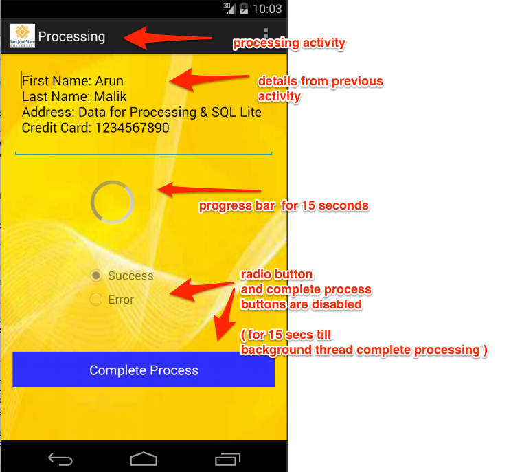

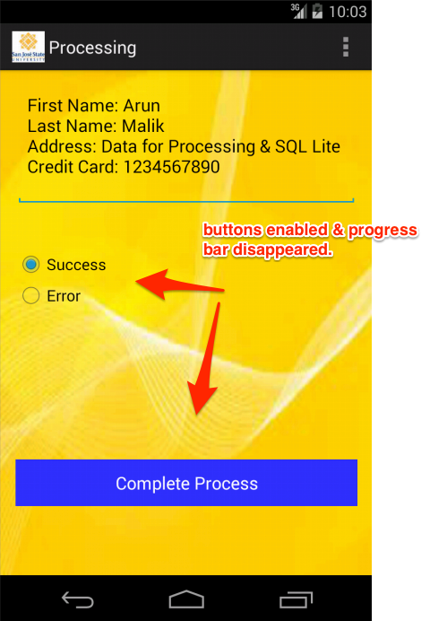

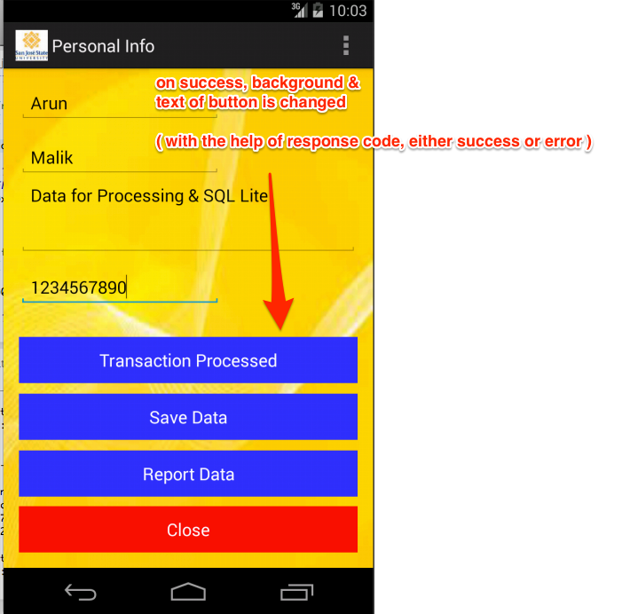

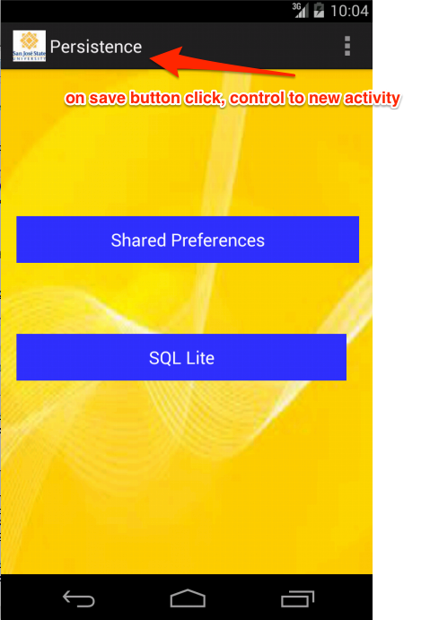

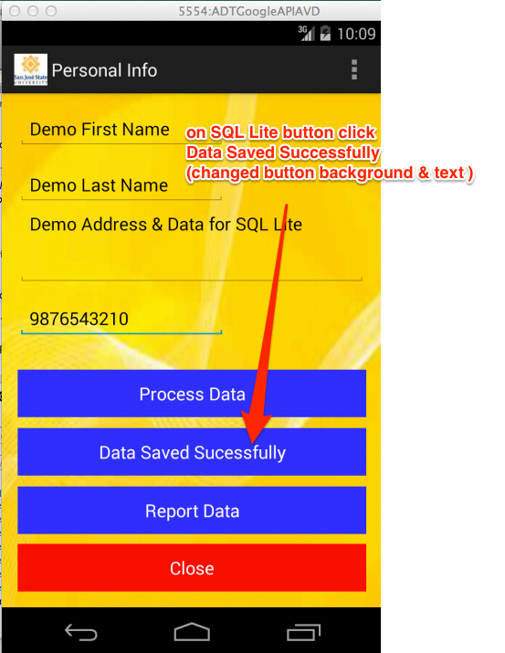

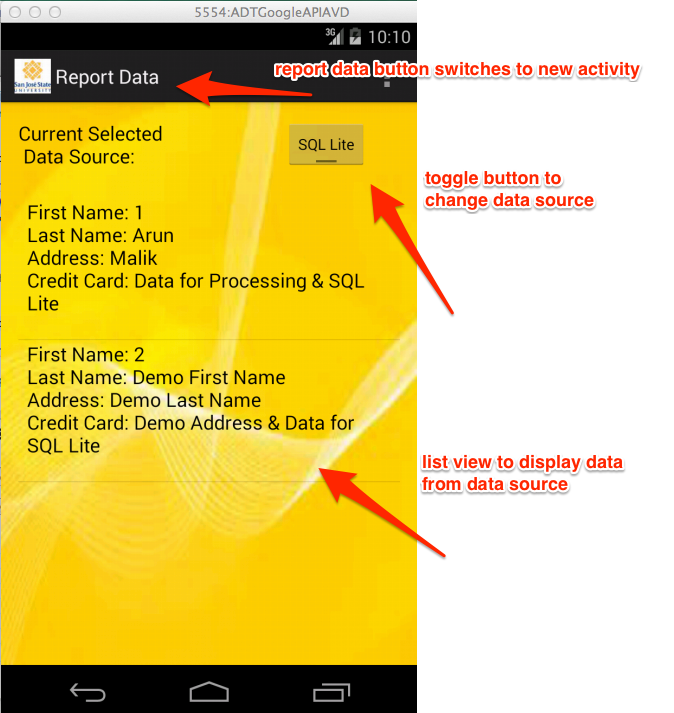

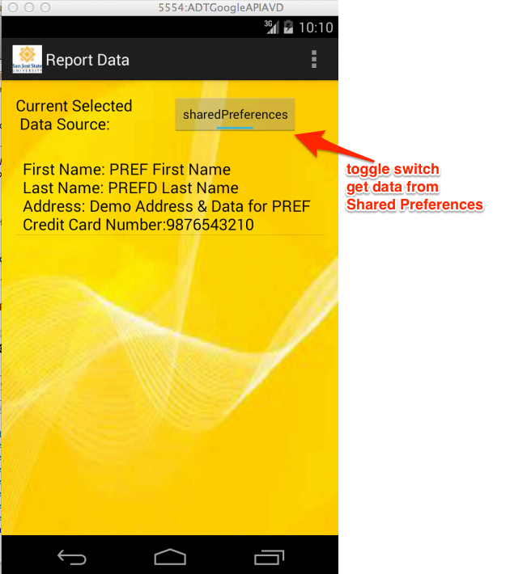

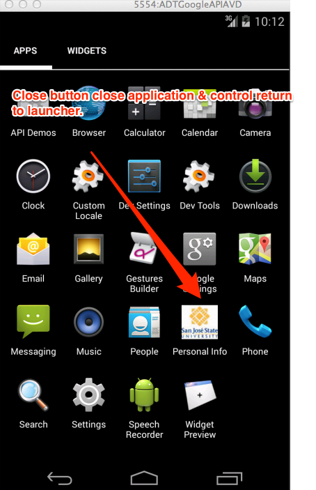

